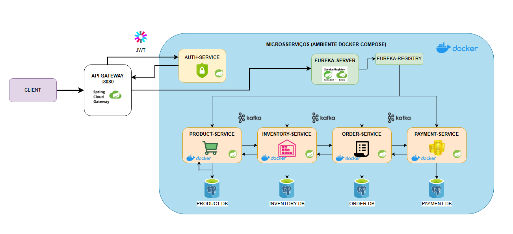

# 🛒 Micrommerce

Micrommerce é uma aplicação de e-commerce construída com arquitetura de microsserviços, projetada para demonstrar uma estrutura escalável e resiliente. A solução é composta por serviços independentes responsáveis por autenticação, catálogo de produtos, controle de estoque, pedidos e pagamentos. Todos os serviços se comunicam por meio de um gateway central e utilizam registro de serviços com Eureka.

## 🔧 Tecnologias Utilizadas

- **Java 21**
- **Spring Boot 3.4.5**
- **Spring Cloud Netflix Eureka (Discovery Service)**
- **Spring Cloud Gateway**
- **Spring Security + JWT**
- **Spring Data JPA + H2 (ambiente dev) / PostgreSQL (ambiente prod)**
- **Apache Kafka** (eventos assíncronos para alguns serviços)
- **Docker + Docker Compose**

## 📦 Estrutura dos Microsserviços

| Serviço           | Porta Padrão | Descrição                                                |
|-------------------|--------------|------------------------------------------------------------|
| `api-gateway`     | `8080`       | Roteador de requisições. Encaminha chamadas aos serviços. |
| `auth-service`    | `8081`       | Serviço de autenticação e geração/validação de JWT.       |
| `product-service` | `8082`       | Gerenciamento do catálogo de produtos.                    |
| `inventory-service` | `8083`     | Controle e consulta de estoque.                           |
| `order-service`   | `8084`       | Processamento de pedidos.                                 |
| `payment-service` | `8085`       | Processamento de pagamentos.                              |
| `eureka-server`   | `8761`       | Registro e descoberta dos serviços.                       |
| `kafka` / `zookeeper` | `9092` / `2181` | Infraestrutura de mensageria assíncrona.              |

## Diagrama do Sistema



## ▶️ Como Executar o Projeto

### Pré-requisitos

- Docker
- Docker Compose

### Passos

1. Clone o repositório:
```bash
   git clone https://github.com/seu-usuario/micrommerce.git
   cd micrommerce
```

2. Gere os .jar de cada serviço (ou configure Dockerfile para fazer isso no build):
```bash
   ./mvnw clean package -DskipTests
```

3. Execute o ambiente completo com Docker Compose:
```bash
   docker-compose up --build
```

4. Acesse os serviços:
- Eureka Dashboard: http://localhost:8761
- API Gateway: http://localhost:8080

## 🚧 Em Desenvolvimento
Funcionalidades previstas:
- Implementação de frontend
- Integração com gateways de pagamento reais (ex: Stripe)
- Suporte a escalonamento horizontal
- Documentação com Swagger/OpenAPI

## 🤝 Contribuições
Contribuições são bem-vindas! Sinta-se à vontade para abrir issues, propor melhorias ou enviar pull requests.

## 📄 Licença
Este projeto está licenciado sob a MIT License.

## 🧠 Autores
- @matheusbus
- @rdalmarco
- @EduardoSangaletti
